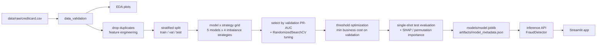

# Credit Card Fraud Detection

**In plain English:** every time you tap your card, the bank has a split second to decide whether
it's really you spending. This project builds that decision-maker — a model that reads a
transaction and answers *"how likely is this fraud?"* It learned from 284,807 real (anonymized)
European card transactions, of which only 492 were fraudulent. On data it had never seen, it
catches about **3 of every 4 frauds** while wrongly flagging just **3 genuine customers out of
56,651** — in money terms, preventing roughly **74% of fraud losses**. Because it outputs a
probability rather than a yes/no, the bank can turn one dial — the decision threshold — to trade
off missed fraud against annoyed customers, without retraining anything.

Under the hood, it is a production-style machine learning system built on the
[Kaggle Credit Card Fraud dataset](https://www.kaggle.com/datasets/mlg-ulb/creditcardfraud)
(284,807 transactions, 492 frauds — 0.172%). The system outputs a **fraud probability**, converts it
to a decision with a **business-cost-optimized threshold**, and ships with a full evaluation suite,
explainability, tests, and a Streamlit app.

## Business problem

Banks approve or decline transactions in milliseconds. The two error types have asymmetric costs:

- **False negative** (missed fraud): the bank eats the transaction amount + chargeback fees.
- **False positive** (blocked genuine customer): support cost, checkout friction, churn risk.

So the goal is not accuracy (a model predicting "genuine" always is 99.8% accurate and worthless) —
it is **high recall at acceptable precision**, with the operating threshold chosen by dollar cost,
not by the default 0.5.

## Architecture



## Project structure

```
├── app/
│   └── streamlit_app.py      # Streamlit UI: single + batch prediction
├── artifacts/                # experiment table, metrics JSON, importance CSVs
├── configs/
│   └── config.yaml           # every knob lives here, not in code
├── data/
│   ├── raw/                  # creditcard.csv (auto-downloaded, gitignored)
│   └── processed/
├── logs/                     # pipeline.log — full audit trail of every run
├── models/                   # model.joblib (gitignored, regenerated by pipeline)
├── notebooks/                # orchestration only — all logic imported from src/
│   ├── 01_data_understanding.ipynb
│   ├── 02_eda.ipynb
│   ├── 03_feature_engineering.ipynb
│   ├── 04_model_training.ipynb
│   └── 05_model_evaluation.ipynb
├── reports/
│   ├── images/               # all generated figures
│   └── RESULTS.md            # full performance report
├── src/
│   ├── data_loader.py        # download + load with integrity checks
│   ├── data_validation.py    # schema / missing / duplicates / target checks
│   ├── eda.py                # plot suite
│   ├── feature_engineering.py# Hour, Amount_log (+ rationale)
│   ├── preprocessing.py      # dedup, stratified 3-way split, scaler
│   ├── model_training.py     # model zoo, imbalance strategies, grid, tuning
│   ├── evaluation.py         # metrics, threshold optimization, cost, plots
│   ├── explainability.py     # permutation importance + SHAP
│   ├── inference.py          # FraudDetector: raw txn -> proba/class/risk
│   ├── train_pipeline.py     # end-to-end orchestrator
│   └── utils.py              # config, logging, IO helpers
└── tests/                    # pytest suite (39 tests, synthetic data)
```

## Setup

```bash
python3 -m venv .venv && source .venv/bin/activate
pip install -r requirements.txt
```

## Usage

```bash
# Full pipeline: download -> validate -> EDA -> train grid -> tune -> evaluate -> explain -> save
python -m src.train_pipeline            # ~20-40 min on a laptop
python -m src.train_pipeline --skip-eda --skip-tuning   # faster re-run

# Tests
python -m pytest tests/ -q

# App
streamlit run app/streamlit_app.py
```

## Method highlights

- **Leakage discipline**: duplicates dropped before splitting; scaler and resamplers live inside
  pipelines (fit on training folds only); threshold tuned on validation; test set touched once.
- **Imbalance**: compared class weighting, SMOTE, random undersampling, SMOTE+Tomek — all inside
  imblearn pipelines. Selection by **validation PR-AUC**, not ROC-AUC (which is inflated at 0.17%
  positive rate).
- **Threshold as a business decision**: cost = Σ(missed fraud amounts) + $5 × false alarms,
  minimized on validation and only then applied to test.
- **Explainability**: permutation importance (model-agnostic) + SHAP (per-prediction attribution)
  agree with EDA on the top features — V14, V10, V12, V4, V17.

## Results

**Champion: XGBoost + class weighting** (selected from 17 model × strategy combinations by
validation PR-AUC), decision threshold 0.669 (business-cost optimal). Held-out test set:

| Precision | Recall | F1 | PR-AUC | ROC-AUC | FP / 56,651 genuine | Cost saved vs no model |
|---|---|---|---|---|---|---|
| 0.960 | 0.758 | 0.847 | 0.821 | 0.973 | 3 | 74.1% |

Notable negative results (documented in [reports/RESULTS.md](reports/RESULTS.md)): random
undersampling consistently degraded every model; SMOTE+Tomek matched plain SMOTE at 20–60× the
cost; LightGBM collapsed under extreme class weighting (scale_pos_weight≈601) while XGBoost did
not; hyperparameter tuning failed to beat XGBoost defaults and was rejected by the
keep-only-if-better guardrail.

See [reports/RESULTS.md](reports/RESULTS.md) for the full report with all figures.

## Future improvements

- Probability calibration (isotonic/Platt) so probabilities are directly interpretable as risk.
- Amount-aware thresholds (block cheap-to-review, step-up-authenticate expensive transactions).
- Streaming features (per-card velocity, merchant history) — impossible on this anonymized dataset,
  standard in production systems.
- Drift monitoring + scheduled retraining; champion/challenger deployment.
- Model registry (MLflow) and CI running the pytest suite.
