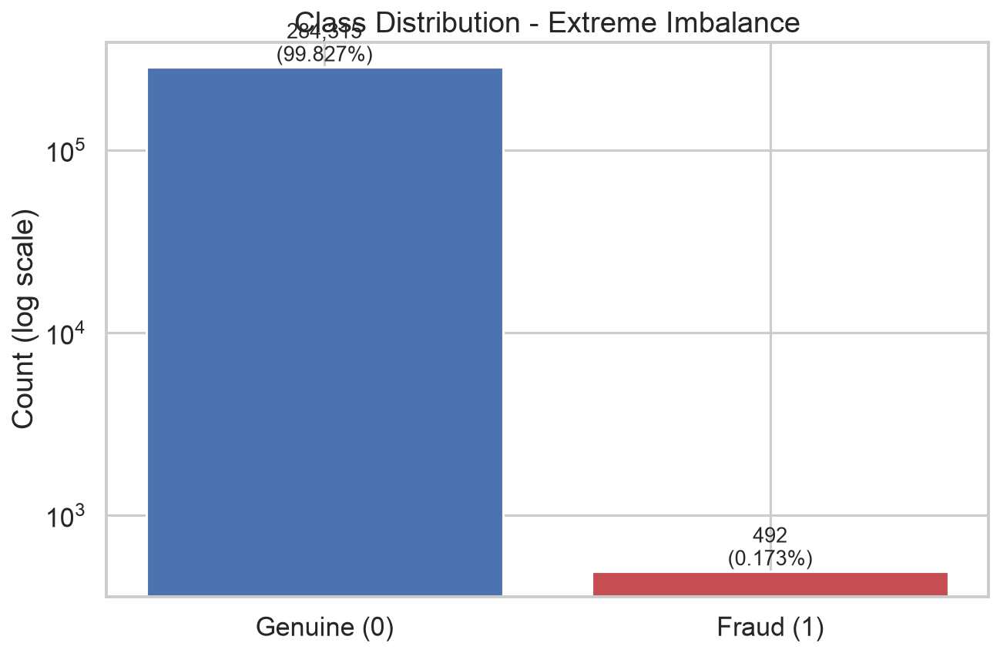
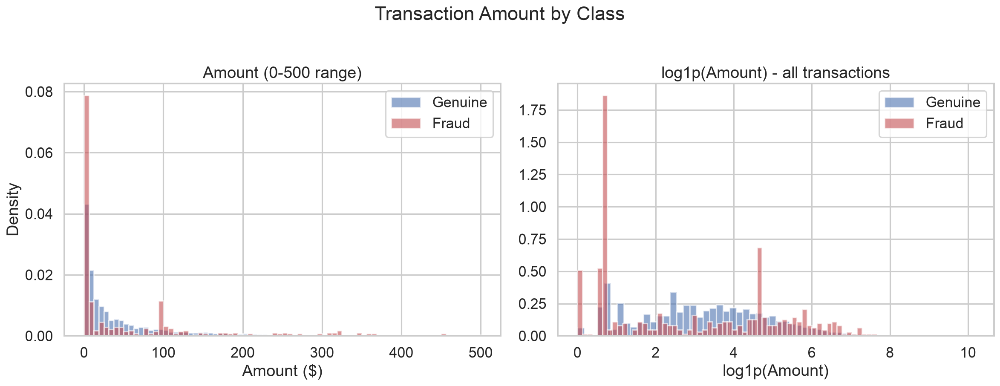
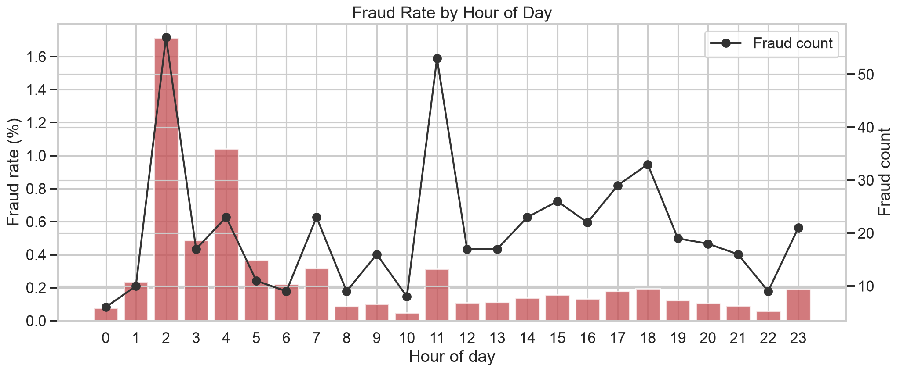
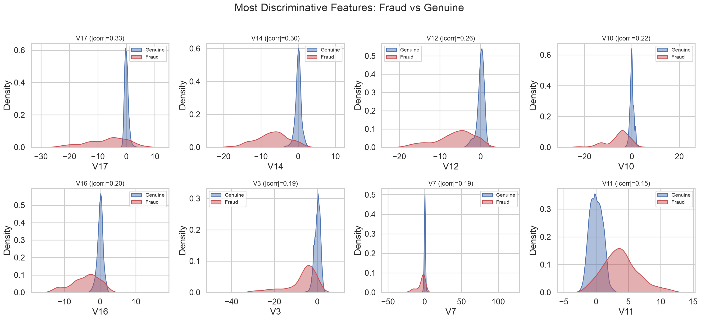
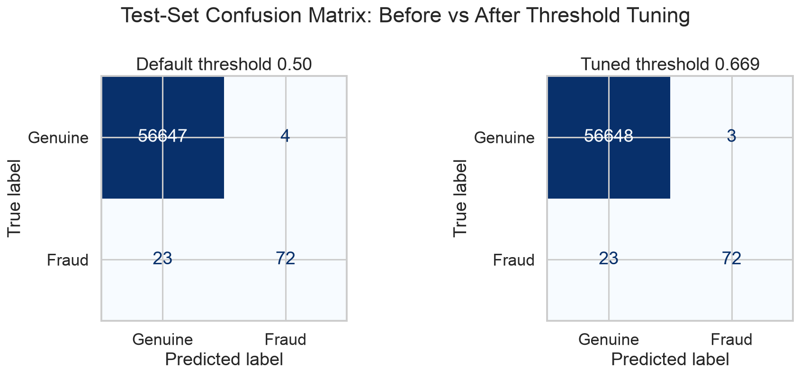
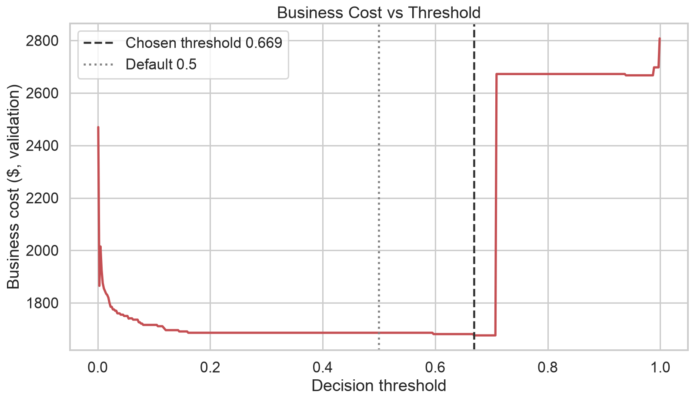
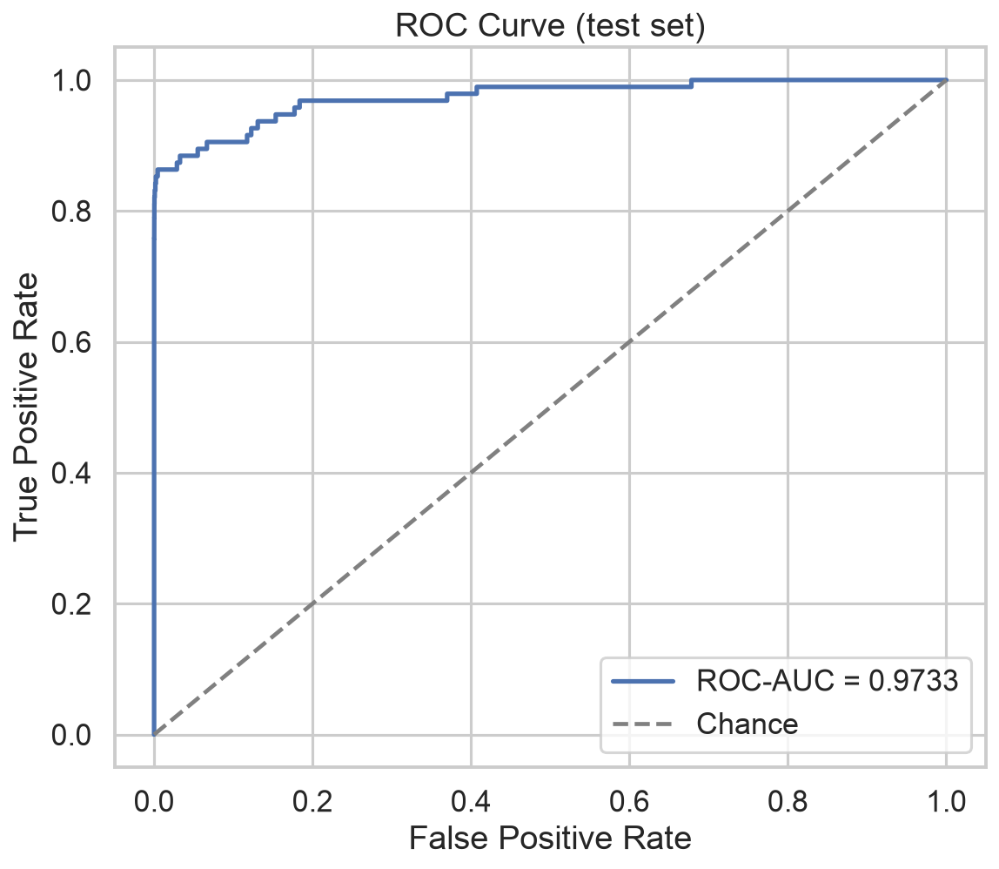
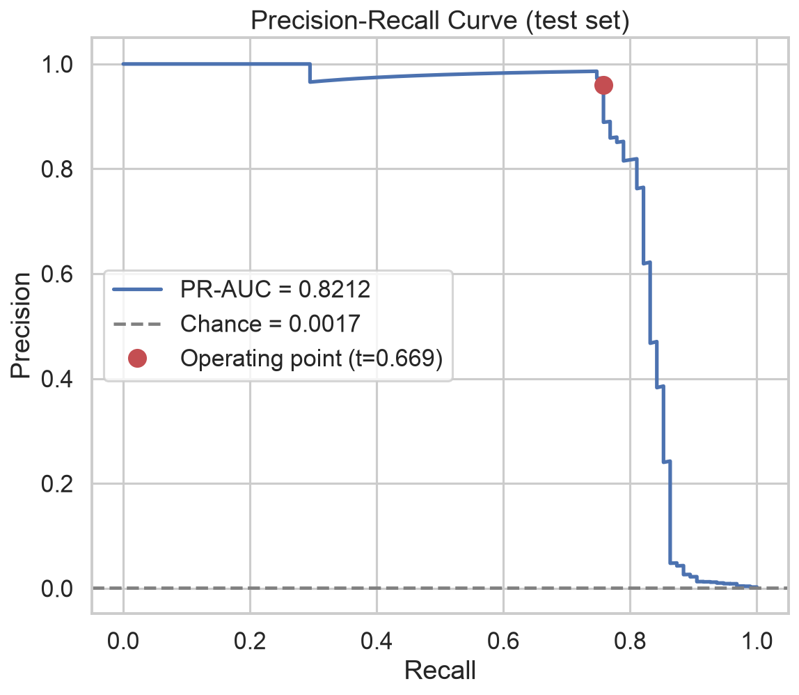
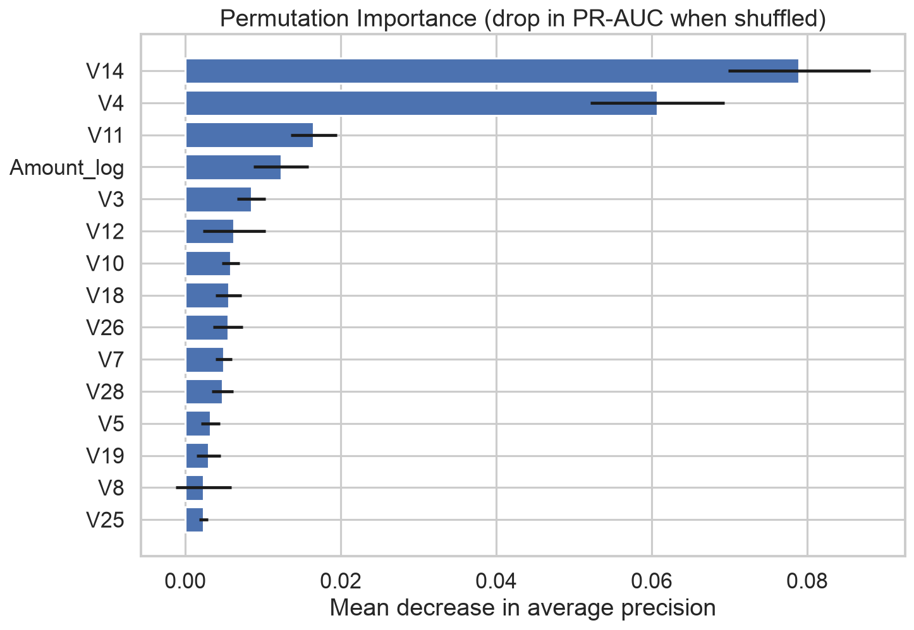
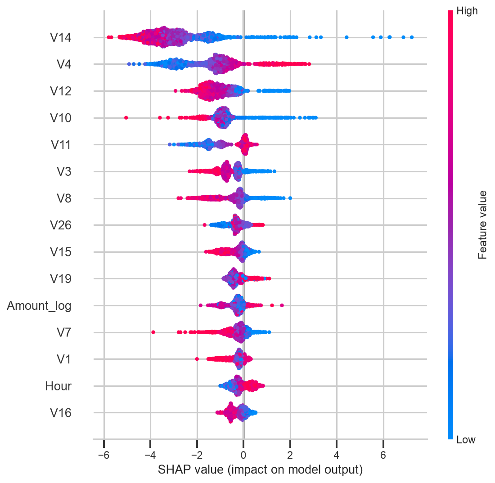

# Results Report — Credit Card Fraud Detection

**Run date:** 2026-07-31 · **Pipeline runtime:** 18.1 min · **Data:** 284,807 transactions
(283,726 after dropping 1,081 duplicates), 473 frauds after dedup.
Split: train 181,584 / validation 45,396 / test 56,746 (stratified, fraud rate 0.166–0.167% in each).

## Headline numbers (held-out test set, touched once)

| Metric | Value |
|---|---|
| **Champion model** | XGBoost + class weighting (`scale_pos_weight≈601`) |
| **Decision threshold** | 0.669 (business-cost optimal on validation) |
| **Precision** | **0.960** — 72 of 75 alerts were real fraud |
| **Recall** | **0.758** — 72 of 95 frauds caught |
| **F1** | 0.847 |
| **PR-AUC** | 0.821 (chance level = 0.0017) |
| **ROC-AUC** | 0.973 |
| **Confusion matrix** | TP 72 · FP 3 · FN 23 · TN 56,648 |
| **Business cost** | $3,827 vs $14,766 with no model → **74.1% of fraud dollars saved** |
| **False-alarm rate** | 3 in 56,651 genuine transactions (0.005%) |

## Experiment grid — 17 model × imbalance-strategy combinations

Selection metric: PR-AUC on the validation set. Full table in `artifacts/experiments.csv`.

| Rank | Model | Strategy | Val PR-AUC | Val ROC-AUC | Fit (s) |
|---|---|---|---|---|---|
| 1 | XGBoost | class_weight | **0.8785** | 0.9731 | 3.1 |
| 2 | XGBoost | smote | 0.8745 | 0.9665 | 5.9 |
| 3 | XGBoost | smote_tomek | 0.8745 | 0.9665 | 153.0 |
| 4 | Random Forest | class_weight | 0.8711 | 0.9506 | 25.6 |
| 5 | Random Forest | smote | 0.8702 | 0.9568 | 147.6 |
| 6 | Random Forest | smote_tomek | 0.8702 | 0.9568 | 281.4 |
| 7 | LightGBM | smote_tomek | 0.8564 | 0.9575 | 147.5 |
| 8 | LightGBM | smote | 0.8564 | 0.9575 | 8.9 |
| 9 | Balanced RF | internal | 0.8143 | 0.9678 | 2.4 |
| 10 | Logistic Regression | class_weight | 0.8102 | 0.9790 | 0.2 |
| 11 | Logistic Regression | smote | 0.8095 | 0.9771 | 0.6 |
| 12 | Logistic Regression | smote_tomek | 0.8095 | 0.9771 | 164.6 |
| 13 | Random Forest | undersample | 0.7893 | 0.9639 | 0.3 |
| 14 | XGBoost | undersample | 0.7678 | 0.9766 | 0.7 |
| 15 | LightGBM | undersample | 0.7628 | 0.9762 | 1.2 |
| 16 | Logistic Regression | undersample | 0.5845 | 0.9744 | 0.1 |
| 17 | LightGBM | class_weight | 0.0026 | 0.6715 | 2.3 |

### What the grid teaches

1. **Class weighting beats resampling for boosting/bagging** — the strong learners extract minority
   signal from loss weighting alone; synthesizing data adds cost without benefit here.
2. **SMOTE+Tomek ≈ SMOTE at 20–60× the cost.** Tomek cleaning changed validation PR-AUC by ~0.0000
   in every pairing while adding 2.5–4.5 minutes of nearest-neighbor search per fit.
3. **Random undersampling always loses** (ranks 13–16): discarding 99.8% of genuine rows destroys
   the majority-class structure the model needs for precision.
4. **LightGBM + extreme class weight collapsed** (PR-AUC 0.0026, chance level): `scale_pos_weight≈601`
   destabilizes its leaf-wise growth; with SMOTE instead, LightGBM is a normal 0.856. Same weighting
   worked fine for XGBoost — a caution against assuming boosting libraries are interchangeable.
5. **ROC-AUC cannot rank these models** — it sits at 0.95–0.98 for almost every row (including
   undersampling failures) because true negatives dwarf everything. PR-AUC spreads the field.
   This is the empirical case for choosing PR-AUC under extreme imbalance.

## Hyperparameter tuning

RandomizedSearchCV (12 candidates × 3 stratified folds, average-precision objective) on the winner:
best CV candidate (`n_estimators=500, lr=0.05, subsample=0.8, colsample=0.8`) scored **0.8760** on
validation vs **0.8785** untuned → tuned model rejected, defaults kept. With only 302 training
frauds, aggressive tuning mostly fits fold noise; the guardrail "keep tuned only if it beats
untuned on validation" prevented a silent regression.

## Threshold optimization

Cost model: missed fraud costs its transaction amount; false alarm costs $5.

- Cost-optimal, F1-optimal, and F2-optimal thresholds all landed at **0.669**.
- Test-set effect vs default 0.5: false positives 4 → 3, recall unchanged — cost $3,832 → $3,827.
- The cost curve (`reports/images/threshold_cost_curve.png`) is **flat between ~0.3 and ~0.7**:
  XGBoost separates the classes so sharply that few transactions receive mid-range scores.
  The honest conclusion is that this model's ranking is strong enough that threshold choice barely
  matters *within that band* — but the machinery matters in general: with the class-weighted
  training, scores are inflated, and a naive team could have deployed at 0.9+ and silently lost recall.

## Error analysis

- **3 false positives** among 56,651 genuine test transactions — far below any realistic
  operations threshold for alert fatigue.
- **23 false negatives** (24% of test frauds) with a combined value of ~$3,712 — these are frauds
  whose feature patterns resemble genuine activity. Recall beyond ~76% at this precision would
  require features this anonymized dataset cannot provide (card velocity, merchant history,
  device fingerprints).
- Validation PR-AUC (0.879) vs test PR-AUC (0.821): with only 76 validation / 95 test frauds,
  a gap of this size is expected sampling variance, not overfitting — worth stating plainly
  rather than hiding.

## Explainability

Permutation importance (metric-drop when shuffled) and SHAP (per-prediction attribution) agree,
and both match what EDA flagged as the most class-separating features:

| Rank | SHAP top features | Mean abs SHAP |
|---|---|---|
| 1 | V14 | 3.04 |
| 2 | V4 | 1.64 |
| 3 | V12 | 1.15 |
| 4 | V10 | 1.00 |
| 5 | V11 | 0.83 |

Strongly negative V14/V12/V10 push predictions toward fraud (visible in the beeswarm
`reports/images/shap_summary.png`). The features are PCA-anonymized so we cannot name the raw
signals, but the consistency EDA → model importance → SHAP is itself the audit: the model relies
on exactly the dimensions where fraud and genuine distributions visibly separate.

## Figures

| | |
|---|---|
|  |  |
|  |  |
|  |  |
|  |  |
|  |  |

## Reproducibility & audit trail

- `configs/config.yaml` — every parameter of the run
- `logs/pipeline.log` — timestamped log of every stage
- `artifacts/validation_report.json` — data-quality checks
- `artifacts/experiments.csv` — full grid results
- `artifacts/model_metadata.json` — champion, threshold, metrics, tuning outcome
- `artifacts/test_evaluation.json` — final metrics + business cost
- Fixed seed (42) throughout; stratified splits; test set evaluated exactly once.
